<div align="center">

  
  
  # WAREHOUSE YMS V3 ENTERPRISE
  
  **Sistem Manajemen Logistik & Antrian Gudang Terintegrasi**
  
  [](https://reactjs.org/)
  [](https://www.typescriptlang.org/)
  [](https://supabase.com/)
  [](https://tailwindcss.com/)
  [](https://github.com/Andrna09)

  <p align="center">
    <strong>Zero Latency · High Security · Automated Flow</strong><br/>
    Solusi manajemen yard modern dengan teknologi Realtime Database dan integrasi WhatsApp Gateway
  </p>

  <br />

</div>

---

## 💎 Keunggulan Fitur (V3 Enterprise)

Sistem ini telah di-upgrade ke standar korporasi dengan fokus pada **Kecepatan**, **Keamanan**, dan **User Experience**.

### ⚡ Superfast Realtime Engine
*Tidak ada lagi tombol refresh.*
* **Instant Sync:** Security Dashboard dan Layar Driver tersinkronisasi dalam hitungan milidetik (0.1s).
* **Technology:** Menggunakan teknologi **Supabase Realtime Subscription** menggantikan metode *polling* lama.

### 🎫 Hybrid Smart Ticketing
Satu URL, dua wajah. Sistem tiket cerdas yang beradaptasi dengan status operasional:

| Phase | Status | Tampilan | Deskripsi |
| :--- | :--- | :--- | :--- |
| **1** | **Booking** | 🟣 **PINK** | **Official Entry Pass** berisi Slot Waktu |
| **2** | **Inside** | 🟢 **HIJAU** | **Queue Ticket** berisi Nomor Antrian |
| **3** | **Expired** | ⚫ **ABU** | **Void/Hangus** otomatis saat checkout |

### 🛡️ Security Gate System
Modul khusus untuk pos keamanan dengan fitur ketat:
* **QR Scanner Terintegrasi:** Scan tiket langsung dari dashboard.
* **Digital Checklist:** Pemeriksaan APD (Helm, Rompi, Sepatu) wajib sebelum masuk.
* **Anti-Fraud:** Nomor antrian (`SOC-001`) digenerate berurutan oleh server, mustahil dipalsukan.

### 🤖 WhatsApp Automation
Notifikasi otomatis terkirim ke driver tanpa intervensi manual:
* ✅ **BOOKING APPROVED** → Kirim Link Tiket
* ✅ **CHECK-IN SUCCESS** → Kirim Nomor Antrian
* ✅ **DOCK ASSIGNMENT** → Panggilan Bongkar Muat
* ✅ **CHECK-OUT** → Surat Jalan Digital Selesai

---

## 🔄 Alur Kerja Sistem

```mermaid
graph LR
    A[🏠 Driver Booking] -->|Admin Approve| B(🎟️ Tiket Pink WA)
    B -->|Datang ke Gudang| C{🚧 Security Gate}
    C -->|Scan & Cek Fisik| D[✅ Check-In Berhasil]
    D -->|Auto Generated| E(🎫 Tiket Hijau WA)
    E -->|Realtime Update| F[🚛 Proses Bongkar]
    F -->|Selesai| G[🏁 Checkout / Keluar]
    G -->|Tiket Hangus| H(❌ Sesi Berakhir)

```



---

## 🛠️ Tech Stack & Architecture

Dibangun dengan teknologi modern untuk performa maksimal.

| Component | Technology | Description |
| --- | --- | --- |
| **Frontend** | React + Vite | Performa rendering ultra-cepat |
| **Language** | TypeScript | Type-safety untuk kode yang solid |
| **Styling** | Tailwind CSS | Desain responsif & modern (Glassmorphism) |
| **Database** | Supabase | PostgreSQL dengan fitur Realtime |
| **Icons** | Lucide React | Ikon vektor ringan & tajam |
| **QR Engine** | QRCode.react | Generator QR Code client-side |

---

## 🚀 Instalasi & Penggunaan

Ikuti langkah ini untuk menjalankan project di lokal komputer Anda.

### Prasyarat

* Node.js (v18+)
* Akun Supabase (untuk database)

### Langkah-langkah

1. **Clone Repository**
```bash
git clone [https://github.com/Andrna09/warehouse-yms-v3.git](https://github.com/Andrna09/warehouse-yms-v3.git)
cd warehouse-yms-v3

```


2. **Install Dependencies**
```bash
npm install

```


3. **Konfigurasi Environment**
Buat file `.env` di root folder:
```env
VITE_SUPABASE_URL=[https://your-project.supabase.co](https://your-project.supabase.co)
VITE_SUPABASE_ANON_KEY=your-anon-key-here

```


4. **Jalankan Development Server**
```bash
npm run dev

```


---

<div align="center">

<h3>👑 Developed By Andrna</h3>
<p><i>"Quality code for quality logistics operation."</i></p>

<a href="https://github.com/Andrna09">

</a>


<sub>© 2026 Warehouse YMS V3 Enterprise. All Rights Reserved.</sub>

</div>