<div align="center">

  
  
  # WAREHOUSE YMS V3 ENTERPRISE
  
  **Sistem Manajemen Logistik & Antrian Gudang Terintegrasi**
  
  [](https://reactjs.org/)
  [](https://www.typescriptlang.org/)
  [](https://supabase.com/)
  [](https://tailwindcss.com/)
  [](https://github.com/Andrna09)

  <p align="center">
    <strong>Zero Latency · High Security · Automated Flow</strong><br/>
    Solusi manajemen yard modern dengan teknologi Realtime Database dan integrasi WhatsApp Gateway
  </p>

  

</div>

---

## 💎 Keunggulan Fitur (V3 Enterprise)

Sistem ini telah di-upgrade ke standar korporasi dengan fokus pada **Kecepatan**, **Keamanan**, dan **User Experience**.

### ⚡ Superfast Realtime Engine
Tidak ada lagi tombol *refresh*.

- **Security Dashboard** dan **Layar Driver** tersinkronisasi dalam hitungan milidetik (0.1s)
- Menggunakan teknologi **Supabase Realtime Subscription** menggantikan metode *polling* lama

### 🎫 Hybrid Smart Ticketing
Satu URL, dua wajah. Sistem tiket cerdas yang beradaptasi dengan status operasional:

| Phase | Status | Tampilan | Deskripsi |
|:-----:|:------:|:--------:|-----------|
| **1** | Booking | 🟣 **PINK** | Official Entry Pass berisi Slot Waktu |
| **2** | Inside | 🟢 **HIJAU** | Queue Ticket berisi Nomor Antrian |
| **3** | Expired | ⚫ **ABU-ABU** | Void/Hangus otomatis saat checkout |

### 🛡️ Security Gate System
Modul khusus untuk pos keamanan dengan fitur ketat:

- **QR Scanner Terintegrasi** — Scan tiket langsung dari dashboard
- **Digital Checklist** — Pemeriksaan APD (Helm, Rompi, Sepatu) wajib sebelum masuk
- **Anti-Fraud** — Nomor antrian (`SOC-001`) digenerate berurutan oleh server, mustahil dipalsukan

### 🤖 WhatsApp Automation
Notifikasi otomatis terkirim ke driver tanpa intervensi manual:

```
✅ BOOKING APPROVED    → Kirim Link Tiket
✅ CHECK-IN SUCCESS    → Kirim Nomor Antrian
✅ DOCK ASSIGNMENT     → Panggilan Bongkar Muat
✅ CHECK-OUT           → Surat Jalan Digital Selesai
```

---

## 🔄 Alur Kerja Sistem

```mermaid
graph LR
    A[🏠 Driver Booking] -->|Admin Approve| B(🎟️ Tiket Pink WA)
    B -->|Datang ke Gudang| C{🚧 Security Gate}
    C -->|Scan & Cek Fisik| D[✅ Check-In Berhasil]
    D -->|Auto Generated| E(🎫 Tiket Hijau WA)
    E -->|Realtime Update| F[🚛 Proses Bongkar]
    F -->|Selesai| G[🏁 Checkout / Keluar]
    G -->|Tiket Hangus| H(❌ Sesi Berakhir)
```



---

## 🛠️ Tech Stack & Architecture

Dibangun dengan teknologi modern untuk performa maksimal.

| Component | Technology | Description |
|-----------|------------|-------------|
| **Frontend** | React + Vite | Performa rendering ultra-cepat |
| **Language** | TypeScript | Type-safety untuk kode yang solid |
| **Styling** | Tailwind CSS | Desain responsif & modern (Glassmorphism) |
| **Database** | Supabase | PostgreSQL dengan fitur Realtime |
| **Icons** | Lucide React | Ikon vektor ringan & tajam |
| **QR Engine** | QRCode.react | Generator QR Code client-side |

---

## 🚀 Instalasi & Penggunaan

Ikuti langkah ini untuk menjalankan project di lokal komputer Anda.

### Prasyarat

- Node.js (v18+)
- Akun Supabase (untuk database)

### Langkah-langkah

**1. Clone Repository**

```bash
git clone https://github.com/Andrna09/warehouse-yms-v3.git
cd warehouse-yms-v3
```

**2. Install Dependencies**

```bash
npm install
```

**3. Konfigurasi Environment**

Buat file `.env` di root folder:

```env
VITE_SUPABASE_URL=https://your-project.supabase.co
VITE_SUPABASE_ANON_KEY=your-anon-key-here
```

**4. Jalankan Development Server**

```bash
npm run dev
```

---

## 👨‍💻 Developer & Credits

<div align="center">

### 👑 Developed By Andrna

*"Quality code for quality logistics operation."*

[](https://github.com/Andrna09)

---

<sub>© 2026 Warehouse YMS V3 Enterprise. All Rights Reserved.</sub>

</div>