<div align="center">


# Warehouse YMS V3 Enterprise

### Sistem Manajemen Logistik & Antrian Gudang Terintegrasi

[](https://reactjs.org/)
[](https://www.typescriptlang.org/)
[](https://supabase.com/)
[](https://tailwindcss.com/)

**Zero Latency · High Security · Automated Flow**

Solusi manajemen yard modern dengan teknologi Realtime Database dan integrasi WhatsApp Gateway

[Demo](https://warehouse-yms.vercel.app) · [Report Bug](https://github.com/Andrna09/warehouse-yms-v3/issues) · [Request Feature](https://github.com/Andrna09/warehouse-yms-v3/issues)


</div>

---

## 📑 Table of Contents

- [Overview](#-overview)
- [Key Features](#-key-features)
- [System Architecture](#-system-architecture)
- [Tech Stack](#️-tech-stack)
- [Getting Started](#-getting-started)
- [Usage](#-usage)
- [Contributing](#-contributing)
- [License](#-license)
- [Contact](#-contact)

---

## 🎯 Overview

**Warehouse YMS V3 Enterprise** adalah sistem manajemen antrian gudang generasi ketiga yang dirancang untuk menghilangkan bottleneck operasional logistics. Dengan arsitektur real-time dan automasi penuh, sistem ini mampu menangani ratusan kunjungan truck harian dengan efisiensi maksimal.

### Why Warehouse YMS?

- ⚡ **Real-time Updates** - Zero delay antara aksi dan notifikasi
- 🔒 **Enterprise Security** - Multi-layer validation dengan anti-fraud system
- 📱 **Mobile-First** - Responsive design untuk semua device
- 🤖 **Full Automation** - WhatsApp notifications tanpa intervensi manual
- 📊 **Smart Analytics** - Track KPI dan operasional metrics

---

## 💎 Key Features

### ⚡ Superfast Realtime Engine

Tidak ada lagi tombol refresh atau delay data.

- **Instant Synchronization** - Dashboard Security dan layar Driver tersinkronisasi dalam milidetik (0.1s)
- **Supabase Realtime** - Menggunakan PostgreSQL replication untuk data consistency
- **Auto-refresh** - Semua perubahan status langsung muncul tanpa user action

### 🎫 Hybrid Smart Ticketing

Satu URL dengan multiple personas berdasarkan status operasional.

<table>
<thead>
<tr>
<th align="center">Phase</th>
<th align="center">Status</th>
<th align="center">Theme</th>
<th>Description</th>
</tr>
</thead>
<tbody>
<tr>
<td align="center"><strong>1</strong></td>
<td align="center">Booking</td>
<td align="center">🟣 <strong>PINK</strong></td>
<td><strong>Official Entry Pass</strong> - Berisi booking code & slot waktu kedatangan</td>
</tr>
<tr>
<td align="center"><strong>2</strong></td>
<td align="center">Inside</td>
<td align="center">🟢 <strong>GREEN</strong></td>
<td><strong>Queue Ticket</strong> - Berisi nomor antrian real-time & status loading</td>
</tr>
<tr>
<td align="center"><strong>3</strong></td>
<td align="center">Expired</td>
<td align="center">⚫ <strong>GRAY</strong></td>
<td><strong>Void/Hangus</strong> - Auto-lock setelah checkout untuk anti-reuse</td>
</tr>
</tbody>
</table>

### 🛡️ Security Gate System

Modul khusus untuk pos keamanan dengan multiple verification layers.

- **QR Scanner Integration** - Built-in scanner tanpa hardware tambahan
- **Digital Safety Checklist** - Mandatory APD verification (Helm, Rompi, Sepatu Safety)
- **Anti-Fraud Protection** - Server-side queue number generation (`SOC-001`, `SOC-002`) yang mustahil dipalsukan
- **Revision Tracking** - Complete audit trail untuk setiap perubahan data

### 🤖 WhatsApp Automation

Notification engine yang mengirim update otomatis pada setiap milestone.

```
✅ BOOKING APPROVED    →  Link tiket booking + instruksi kedatangan
✅ CHECK-IN SUCCESS    →  Nomor antrian + estimasi waktu panggilan  
✅ DOCK ASSIGNMENT     →  Notifikasi panggilan ke dock tertentu
✅ CHECKOUT COMPLETE   →  Konfirmasi selesai + surat jalan digital
```

---

## 🔄 System Architecture

### Workflow Diagram

```mermaid
graph LR
    A[🏠 Driver Booking] -->|Admin Approve| B(🎟️ Pink Ticket via WA)
    B -->|Arrival at Gate| C{🚧 Security Checkpoint}
    C -->|Scan QR & Safety Check| D[✅ Check-In Success]
    D -->|Auto-Generate| E(🎫 Green Ticket via WA)
    E -->|Real-time Status| F[🚛 Loading/Unloading]
    F -->|Process Complete| G[🏁 Checkout]
    G -->|Auto-Expire| H(❌ Session End)
```



### Data Flow

1. **Booking Layer** - Driver submits request → Admin approval → WhatsApp ticket
2. **Security Layer** - QR scan → Safety checklist → Entry authorization
3. **Operations Layer** - Queue management → Dock assignment → Real-time tracking
4. **Exit Layer** - Completion check → Checkout → Ticket expiration

---

## 🛠️ Tech Stack

### Frontend

| Technology | Version | Purpose |
|------------|---------|---------|
| **React** | 18.0 | UI library with hooks & context |
| **Vite** | 5.0 | Ultra-fast build tool & dev server |
| **TypeScript** | 5.0 | Type-safe development |
| **Tailwind CSS** | 3.0 | Utility-first styling |
| **Lucide React** | Latest | Icon library |

### Backend & Services

| Technology | Purpose |
|------------|---------|
| **Supabase** | PostgreSQL database with real-time subscriptions |
| **Supabase Auth** | User authentication & authorization |
| **Supabase Storage** | Document & photo storage |
| **WhatsApp API** | Automated notifications |

### Tools & Libraries

- **QRCode.react** - QR code generation
- **@yudiel/react-qr-scanner** - QR code scanning
- **date-fns** - Date manipulation
- **React Router** - Client-side routing

---

## 🚀 Getting Started

### Prerequisites

Pastikan Anda sudah menginstall:

- **Node.js** >= 18.0.0
- **npm** atau **yarn**
- **Akun Supabase** (gratis di [supabase.com](https://supabase.com))

### Installation

**1. Clone repository**

```bash
git clone https://github.com/Andrna09/warehouse-yms-v3.git
cd warehouse-yms-v3
```

**2. Install dependencies**

```bash
npm install
```

**3. Environment setup**

Buat file `.env` di root directory:

```env
VITE_SUPABASE_URL=https://your-project.supabase.co
VITE_SUPABASE_ANON_KEY=your-anon-key-here
```

**4. Database setup**

Jalankan migration scripts di Supabase SQL Editor:

```sql
-- Lihat file /database/schema.sql untuk struktur lengkap
```

**5. Run development server**

```bash
npm run dev
```

Aplikasi akan berjalan di `http://localhost:5173`

### Build for Production

```bash
npm run build
npm run preview  # Preview production build
```

---

## 📖 Usage

### For Drivers

1. Akses halaman booking
2. Isi data kunjungan (nama, plat nomor, vendor, tujuan)
3. Upload dokumen pendukung
4. Tunggu approval dari admin
5. Terima tiket booking (pink) via WhatsApp
6. Datang ke gudang dan tunjukkan QR code ke security
7. Terima tiket antrian (green) via WhatsApp
8. Tunggu panggilan ke dock
9. Lakukan loading/unloading
10. Checkout di pos security

### For Security

1. Login ke Security Dashboard
2. Scan QR code driver yang datang
3. Verifikasi data dan lakukan safety checklist
4. Approve masuk → sistem auto-generate nomor antrian
5. Monitor truck yang sedang di dalam
6. Scan QR untuk checkout saat driver selesai

### For Admin

1. Login ke Admin Dashboard
2. Review booking requests
3. Approve/reject dengan notes
4. Monitor operasional real-time
5. Kelola gate configuration
6. Export reports

---

## 🤝 Contributing

Kontribusi selalu diterima dengan tangan terbuka! Jika Anda ingin berkontribusi:

1. Fork repository ini
2. Buat feature branch (`git checkout -b feature/AmazingFeature`)
3. Commit changes (`git commit -m 'Add some AmazingFeature'`)
4. Push ke branch (`git push origin feature/AmazingFeature`)
5. Buka Pull Request

---

## 📄 License

Distributed under the MIT License. See `LICENSE` for more information.

---

## 📞 Contact

<div align="center">

### 👑 Developed By Andrna

*"Quality code for quality logistics operation."*

[](https://github.com/Andrna09)
[](https://linkedin.com/in/andrna)
[](mailto:andrna@example.com)

---

**Project Link:** [https://github.com/Andrna09/warehouse-yms-v3](https://github.com/Andrna09/warehouse-yms-v3)

© 2026 Warehouse YMS V3 Enterprise. All Rights Reserved.

</div>

---

<div align="center">

### ⭐ Star this repo if you find it useful!

Made with ❤️ by Andrna

</div>